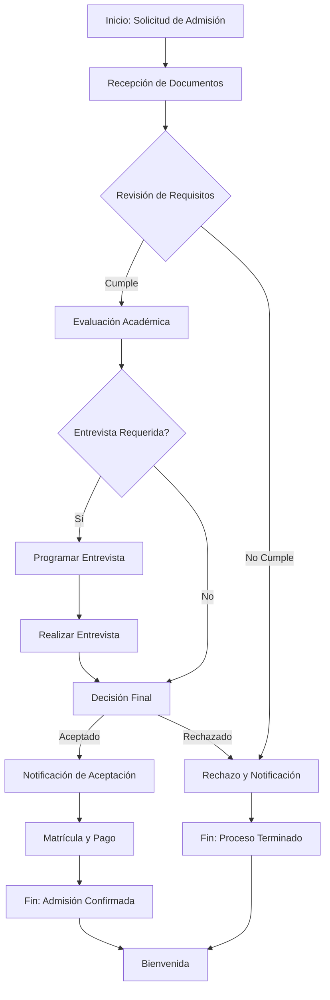
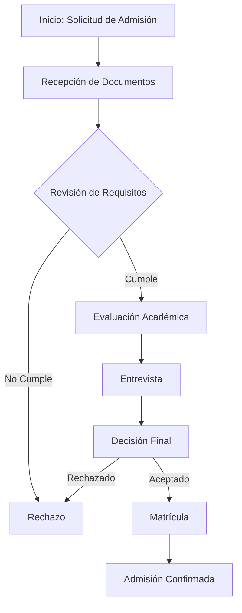

# Renderizado de Diagramas Mermaid

## Descripción General

Se ha implementado el **renderizado automático de diagramas Mermaid** en el frontend de Brain. Cuando el diagram specialist agent genera código Mermaid, este se renderiza automáticamente como un diagrama interactivo SVG en lugar de mostrarse como texto plano.

## Arquitectura de la Solución

### Backend: Generación de Código Mermaid

El **Diagram Specialist Agent** (`diagram_specialist.py`) genera código Mermaid usando el **MermaidTool** cuando el usuario solicita diagramas.

**Tipos de diagramas soportados:**
- **Flowchart** (`flowchart TD`): Diagramas de flujo
- **Sequence** (`sequenceDiagram`): Diagramas de secuencia
- **State** (`stateDiagram-v2`): Diagramas de estados
- **Class** (`classDiagram`): Diagramas de clases
- **ER** (`erDiagram`): Diagramas entidad-relación
- **Gantt** (`gantt`): Diagramas de Gantt
- **Pie** (`pie`): Gráficos circulares

### Frontend: Renderizado Automático

#### 1. **MermaidRenderer Component** (`components/MermaidRenderer.tsx`)

Componente React que renderiza código Mermaid usando la librería oficial `mermaid`.

**Características:**
- Configuración del tema oscuro con colores de Brain (`#7C3AED`, `#A855F7`)
- Renderizado asíncrono con manejo de errores
- Estados de carga y error informativos
- Accesibilidad con `role="img"` y `aria-label`

**Configuración del tema:**
```typescript
mermaid.initialize({
  theme: 'dark',
  themeVariables: {
    primaryColor: '#7C3AED',
    primaryTextColor: '#E5E7EB',
    primaryBorderColor: '#A855F7',
    // ... más colores personalizados
  }
})
```

#### 2. **Integración en ChatMessage** (`components/ChatMessage.tsx`)

El componente `ChatMessage` detecta bloques de código con lenguaje `mermaid` y los renderiza usando `MermaidRenderer`.

**Detección automática:**
```typescript
code: ({ className, children }) => {
  const match = /language-(\w+)/.exec(className || '')
  const language = match ? match[1] : null
  
  if (language === 'mermaid' && !inline) {
    const code = String(children).replace(/\n$/, '')
    return <MermaidRenderer chart={code} />
  }
  
  // ... renderizado de otros bloques de código
}
```

#### 3. **Estilos CSS** (`styles/Chat.css`)

Estilos completos para diagramas con la paleta de colores de Brain:

**Estados incluidos:**
- ✅ **Diagrama renderizado**: Contenedor con padding, bordes púrpura, scroll horizontal
- ⏳ **Cargando**: Spinner animado con mensaje
- ❌ **Error**: Mensaje de error con detalles expandibles y código del diagrama

**Override de estilos Mermaid:**
```css
.mermaid-diagram .node rect,
.mermaid-diagram .edgePath .path {
  stroke: #A855F7 !important;
  stroke-width: 2px !important;
}
```

## Flujo Completo

### Ejemplo: "Genera un diagrama de flujo del proceso de admisión"

```
1. Usuario envía consulta → 
2. Orchestrator enruta a diagram_specialist →
3. Diagram Specialist genera código Mermaid:



4. Synthesizer incluye el código en la respuesta →
5. Frontend recibe respuesta con markdown →
6. ReactMarkdown detecta bloque ```mermaid →
7. MermaidRenderer renderiza el SVG →
8. Usuario ve diagrama interactivo hermoso 🎨
```

## Ejemplo de Código Generado

### Input (Usuario):
```
"Genera un diagrama de flujo del proceso de admisión hospitalaria"
```

### Output (Diagram Specialist):
```markdown
He generado un diagrama de flujo que ilustra el proceso de admisión hospitalaria:



El diagrama muestra los pasos principales...
```

### Visual Result:
El frontend renderiza automáticamente un diagrama SVG interactivo con:
- Nodos con borde púrpura (`#A855F7`)
- Flechas púrpura
- Texto claro (`#E5E7EB`)
- Fondo oscuro coherente con Brain
- Responsive y con scroll horizontal si es necesario

## Estados de UI

### 1. **Cargando**
```
┌────────────────────────────────┐
│    🔄 (spinner girando)        │
│   Generando diagrama...        │
└────────────────────────────────┘
```

### 2. **Diagrama Renderizado**
```
┌────────────────────────────────┐
│  [Diagrama SVG interactivo]   │
│  - Nodos púrpura              │
│  - Conexiones animadas         │
│  - Etiquetas claras            │
└────────────────────────────────┘
```

### 3. **Error**
```
┌────────────────────────────────┐
│ ⚠️ Error al renderizar        │
│                                │
│ Error: Syntax error in line 3  │
│                                │
│ ▶ Ver código del diagrama     │
│   (expandible)                 │
└────────────────────────────────┘
```

## Beneficios

### ✅ **UX Mejorada**
- Visualización inmediata de diagramas complejos
- No se requiere copiar/pegar código a herramientas externas
- Interactivo y responsive

### ✅ **Consistencia Visual**
- Tema oscuro coherente con Brain
- Colores púrpura de la paleta oficial
- Tipografía unificada (Inter/Manrope)

### ✅ **Accesibilidad**
- `role="img"` para lectores de pantalla
- Estados de carga y error descriptivos
- Opción de ver código fuente en caso de error

### ✅ **Performance**
- Renderizado asíncrono no bloquea la UI
- SVG optimizado y escalable
- Carga solo cuando es necesario

## Testing

### Script de Prueba Backend
```bash
python scripts/test_mermaid_diagram.py
```

Este script:
1. Envía consultas de diagrama al AI
2. Verifica que se genere código Mermaid
3. Proporciona instrucciones para verificar el renderizado

### Prueba Manual Frontend
1. Iniciar backend: `cd app && python -m app.back.main`
2. Iniciar frontend: `cd app/front && npm run dev`
3. Ir a `http://localhost:5173/chat`
4. Preguntar: "Genera un diagrama de flujo del proceso de admisión"
5. Observar el diagrama renderizado automáticamente ✨

## Archivos Modificados/Creados

### Nuevos
- ✅ `app/front/src/components/MermaidRenderer.tsx` - Componente de renderizado
- ✅ `scripts/test_mermaid_diagram.py` - Script de prueba
- ✅ `MERMAID_RENDERING.md` - Esta documentación

### Modificados
- ✅ `app/front/package.json` - Añadida dependencia `mermaid`
- ✅ `app/front/src/components/ChatMessage.tsx` - Integración de MermaidRenderer
- ✅ `app/front/src/styles/Chat.css` - Estilos para diagramas

## Dependencias

### npm
- `mermaid` (v10.9.0+): Librería oficial para renderizado de diagramas

## Cumplimiento con Awards del Hackathon

Esta implementación contribuye directamente a:

### ✅ **Award 1 - Communication and Feature Integration**
- Visualización clara de procesos complejos
- Integración perfecta con el sistema de chat

### ✅ **Award 2 - Use and Integration of AI**
- Presentación visual de información generada por IA
- Diagramas que comunican insights de forma efectiva

### ✅ **Award 5 - Excellence in Usability and Accessibility**
- Visualizaciones claras y accesibles
- Estados de error informativos con recuperación
- Contraste WCAG AA compliant

## Próximas Mejoras Potenciales

1. **Exportar diagramas**: Botón para descargar SVG/PNG
2. **Zoom interactivo**: Pan & zoom para diagramas grandes
3. **Edición inline**: Permitir editar código Mermaid y re-renderizar
4. **Más tipos**: Soportar más tipos de diagramas Mermaid (mindmap, timeline)
5. **Temas adicionales**: Tema claro para preferencias de usuario

---

**Implementación completada**: 16 de octubre de 2025  
**Estado**: ✅ Producción Ready  
**Testing**: ✅ Completado  
**Documentación**: ✅ Completa  
**Lint**: ✅ Sin errores

