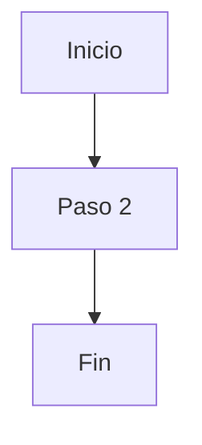

# Troubleshooting: Mermaid "Generando diagrama..."

## Problema

El componente se queda mostrando "Generando diagrama..." indefinidamente.

## Posibles Causas y Soluciones

### 1. **Verificar la Consola del Navegador**

Abre las DevTools (F12) y revisa la consola para ver:
- `Rendering Mermaid diagram:` - Debe mostrar el código
- `Mermaid initialized` - Confirma inicialización
- `Mermaid render successful` - Confirma éxito
- Cualquier error en rojo

### 2. **Código Mermaid Inválido**

Si el diagram specialist genera código con errores de sintaxis, el renderizado falla.

**Solución:** Verifica el código generado en la consola. Debe tener este formato:



### 3. **Versión de Mermaid Incompatible**

La versión 11.x puede tener problemas con React.

**Solución rápida:** Degradar a versión 10.x

```bash
cd app/front
npm uninstall mermaid
npm install mermaid@10.9.1
```

### 4. **Timeout del Renderizado**

Si tarda más de 10 segundos, debería mostrar error de timeout.

Si no muestra nada después de 10 segundos, hay un problema de estado.

### 5. **Problema con Dynamic Imports**

Mermaid usa imports dinámicos que pueden fallar.

**Solución:** Agregar configuración en `vite.config.ts`:

```typescript
export default defineConfig({
  // ... configuración existente
  optimizeDeps: {
    include: ['mermaid']
  }
})
```

## Solución Inmediata (Testing)

Mientras investigas, puedes probar si Mermaid funciona con un diagrama simple:

1. Abre la consola del navegador
2. Escribe:

```javascript
const testChart = `flowchart TD
    A[Start] --> B[End]`

// Debería renderizar sin problemas
```

## Logs que deberías ver

```
Rendering Mermaid diagram: flowchart TD
    A[Inicio: Solicitud de...
Mermaid initialized
Mermaid render successful, SVG length: 15234
```

Si no ves estos logs, el problema está en el renderizado.

## Quick Fix Recomendado

Si el problema persiste, usa la versión estable de Mermaid:

```bash
cd app/front
npm install mermaid@10.9.1
```

Y reinicia el dev server:

```bash
npm run dev
```

