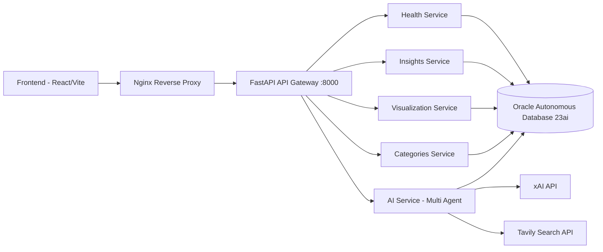

<div align="center">
  

  # Brain

  <p>Mental health admissions research platform built with React, FastAPI, and Oracle Autonomous Database 23ai.</p>

  <p>
    <a href="./LICENSE">
      
    </a>
    <a href="https://github.com/arrozet/malackathon25/actions/workflows/deploy.yml">
      
    </a>
    <a href="https://github.com/arrozet/malackathon25">
      
    </a>
    <a href="https://github.com/arrozet/malackathon25">
      
    </a>
    <a href="https://github.com/arrozet/malackathon25/stargazers">
      
    </a>
  </p>
</div>

Brain is the II Malackathon 2025 project focused on mental health hospital admissions.
It combines secure Oracle data access, exploratory analytics, interactive visualization, and an AI assistant designed for clinical research support.

## Why this project

Mental health admission data is often difficult to explore consistently across technical and non-technical teams. Brain provides one entry point to query, analyze, and visualize the dataset while preserving privacy controls and reproducible workflows.

## Key capabilities

- FastAPI API Gateway with microservice-style routers for health, insights, visualization, categories, and AI.
- Oracle Autonomous Database 23ai integration via wallet-based secure connectivity and connection pooling.
- React + TypeScript frontend for interactive filtering, chart-based exploration, and a research-focused UX.
- Multi-agent AI assistant for natural-language analysis, streaming responses, SQL-backed insights, and diagram generation.
- Dockerized local and production setups with Nginx reverse proxy and automated deployment workflow.
- R-based EDA and feature engineering outputs for analytical traceability.

## Architecture



### Services

| Service | Port | Responsibility |
| --- | --- | --- |
| `frontend` | 5173 | Research UI, filters, charts, AI chat interface |
| `backend` | 8000 | API Gateway, business services orchestration |
| `nginx` | 80/443 | Reverse proxy, TLS termination, routing |
| `oracle-adb` | managed | Clinical dataset storage, views, secure query access |

## Tech stack

| Layer | Technologies |
| --- | --- |
| Frontend | React 19, TypeScript, Vite, Recharts |
| Backend | FastAPI, Python 3.12, Pydantic v2, LangGraph |
| Data | Oracle Autonomous Database 23ai, python-oracledb |
| AI | xAI-compatible LLM API, Tavily search |
| Data science | R (Quarto), PDF reporting |
| Infra | Docker, Docker Compose, Nginx, GitHub Actions |

## Quick start

### Prerequisites

- Docker + Docker Compose
- Oracle wallet files available in `app/oracle_wallet/`
- A root `.env` file with Oracle credentials
- Node.js 20+ (only if running frontend outside Docker)
- Python 3.12 (only if running backend outside Docker)

### 1) Clone the repository

```bash
git clone https://github.com/arrozet/malackathon25.git
cd malackathon25
```

### 2) Create `.env` in project root

Use this as a baseline:

```env
ORACLE_DSN=fagfefcg84y83s1a_medium
ORACLE_USER=DAJER_ADMIN
ORACLE_PASSWORD=<your_oracle_password>
TNS_ADMIN=/app/oracle_wallet
ORACLE_WALLET_PASSWORD=<your_wallet_password>

APP_ENV=prod
DEBUG=false
CORS_ORIGINS=http://localhost:5173,http://127.0.0.1:5173

# AI (required for /api/ai endpoints)
XAI_API_KEY=<your_xai_api_key>
TAVILY_API_KEY=<optional_tavily_key>
```

### 3) Start the full stack

```bash
docker compose up --build
```

### 4) Open the application

- App (through Nginx): `http://localhost`
- API docs (FastAPI): `http://localhost/docs`
- API health: `http://localhost/api/health`

## API overview

Main routes exposed by the backend:

- `GET /` - API Gateway status and service list
- `GET /api/health` - health check with database status
- `GET /api/db/pool-status` - Oracle connection pool status
- `GET /api/insights` - summary metrics for the landing page
- `GET /api/data/visualization` - filtered chart-ready aggregations
- `GET /api/data/categories` - available diagnostic categories
- `POST /api/ai/chat` - non-streaming AI assistant response
- `POST /api/ai/chat/stream` - streaming AI assistant events (SSE)
- `POST /api/ai/analyze` - analysis-focused AI route
- `POST /api/ai/visualize` - Mermaid diagram generation route
- `GET /api/ai/health` - AI subsystem health status

## Local development

### Backend only

```bash
python -m venv .venv
# Windows PowerShell
.\.venv\Scripts\activate
# Linux/macOS
# source .venv/bin/activate

python -m pip install --upgrade pip
python -m pip install -r requirements.txt
uvicorn app.back.main:app --reload --host 0.0.0.0 --port 8000
```

### Frontend only

```bash
cd app/front
npm install
npm run dev
```

## Database setup

Database schema creation, normalization workflow, data loading, anonymization, and read-only user guidance are documented in:

- `database/README.md`

Important scripts include:

- `database/create.sql`
- `database/load_data.sql`
- `database/normalizacion_schema.sql`

## Deployment

Production deployment is automated with GitHub Actions and shell scripts:

- Workflow: `.github/workflows/deploy.yml`
- Manual deploy script: `deploy.sh`
- Non-interactive CI/CD deploy script: `deploy_auto.sh`
- Setup guide: `.github/DEPLOY_SETUP.md`

Current production style targets an Oracle Cloud VM with Nginx + Docker Compose.

## Project structure

```text
.
├── .github/
│   ├── workflows/
│   │   └── deploy.yml
│   └── DEPLOY_SETUP.md
├── app/
│   ├── back/
│   │   ├── main.py
│   │   ├── db.py
│   │   ├── config.py
│   │   ├── routers/
│   │   └── services/
│   ├── front/
│   │   ├── src/
│   │   ├── public/
│   │   └── package.json
│   ├── oracle_wallet/
│   └── RUN.md
├── database/
├── data/
│   └── R/
├── docs/
├── nginx/
├── scripts/
├── docker-compose.yml
├── docker-compose.prod.yml
├── deploy.sh
├── deploy_auto.sh
├── requirements.txt
├── LICENSE
└── README.md
```

## Roadmap

- Expand automated test coverage (backend integration and frontend behavior).
- Introduce stronger auth/authorization controls for sensitive endpoints.
- Improve observability (metrics and dashboards) for API and database usage.
- Continue refining AI assistant reliability and source-grounded responses.

## Contributing

Contributions are welcome. For substantial changes, open an issue first to align on scope.

Typical flow:

1. Fork the repository.
2. Create a branch (`feature/...` or `fix/...`).
3. Keep changes focused and documented.
4. Run relevant checks/tests.
5. Open a pull request with clear context.

## License

This project is licensed under GPL-3.0. See `LICENSE` for details.

## Team

Malackathon 2025 - Dr. Artificial / DAJER Team
