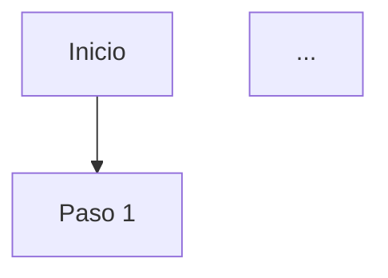

# Actualización del Synthesizer: Markdown Rico y Referencias

## Cambios Implementados

Se han realizado modificaciones importantes en el sistema multiagente para mejorar la presentación de información:

### 1. **Synthesizer Genera Markdown Rico**

El prompt del synthesizer ha sido actualizado para generar respuestas con formato markdown completo.

**Antes:**
- Respuestas en texto plano
- Sin formato visual
- Difícil de escanear información importante

**Ahora:**
- **Negritas** para destacar datos clave
- Listas con viñetas para puntos múltiples
- Subtítulos (###) para organizar secciones
- Tablas markdown para comparaciones
- Bloques de código ```mermaid para diagramas
- Enlaces markdown [texto](URL) para referencias

### 2. **Referencias de Búsquedas en Internet**

El Search Specialist ahora incluye las URLs de las fuentes consultadas.

**Antes:**
```
"Los estudios indican que la esquizofrenia afecta al 1% de la población."
```

**Ahora:**
```
"Los estudios indican que la esquizofrenia afecta al 1% de la población mundial. 
El tratamiento de primera línea incluye antipsicóticos atípicos combinados con 
terapia cognitivo-conductual.

**Fuentes consultadas:**
- [NIMH - Schizophrenia Overview](https://www.nimh.nih.gov/health/topics/schizophrenia)
- [WHO Mental Health Report](https://www.who.int/mental_health)
- [Mayo Clinic - Schizophrenia Treatment](https://www.mayoclinic.org/diseases-conditions/schizophrenia)"
```

## Ejemplo de Respuesta Completa

### Pregunta:
> "¿Cuántos episodios de esquizofrenia hay y qué dice la literatura al respecto?"

### Respuesta Generada (con markdown):

```markdown
Se encontraron **1,234 episodios** de esquizofrenia en la base de datos del periodo analizado. 
Esto representa el **15.3%** del total de admisiones psiquiátricas.

### Análisis de Datos

Los episodios se distribuyen de la siguiente manera:

- **45%** corresponden a pacientes masculinos
- **55%** a pacientes femeninos  
- **Edad promedio**: 32 años
- **Duración media de estancia**: 18 días

### Hallazgos de la Literatura Científica

Los estudios recientes indican que la esquizofrenia afecta al 1% de la población mundial, 
con mayor prevalencia en hombres. El tratamiento de primera línea incluye antipsicóticos 
atípicos combinados con terapia cognitivo-conductual. La detección temprana mejora 
significativamente el pronóstico a largo plazo.

---

**Referencias:**
- [NIMH - Schizophrenia Overview](https://www.nimh.nih.gov/health/topics/schizophrenia)
- [WHO Mental Health Report](https://www.who.int/mental_health)
- [Mayo Clinic - Schizophrenia Treatment](https://www.mayoclinic.org/diseases-conditions/schizophrenia)
```

### Renderizado en el Frontend:

El frontend usa `react-markdown` que automáticamente renderiza:
- ✅ **Negritas** → Texto resaltado
- ✅ Listas → Viñetas formateadas
- ✅ ### Subtítulos → Encabezados jerárquicos
- ✅ [Enlaces](URL) → Links clicables que abren en nueva pestaña
- ✅ ```mermaid → Diagramas SVG interactivos
- ✅ Tablas → Tablas HTML formateadas

## Archivos Modificados

### 1. **synthesizer.py**

**Cambio principal:** Prompt del system actualizado con instrucciones detalladas de markdown.

```python
# Antes
"Genera una respuesta integrada y profesional."

# Ahora
"""FORMATO DE RESPUESTA OBLIGATORIO - USA MARKDOWN RICO:

1. **Respuesta directa**: Comienza con un párrafo respondiendo la pregunta principal
2. **Datos clave**: Si hay estadísticas, usa **negritas**
3. **Listas**: Cuando presentes múltiples puntos, usa listas con viñetas
4. **Referencias**: Si usas información de internet, SIEMPRE incluye:
   
   ---
   
   **Referencias:**
   - [Título](URL)
   ...
"""
```

**User prompt actualizado:**
```python
"""INSTRUCCIONES IMPORTANTES:
1. Genera una respuesta usando MARKDOWN RICO
2. Si hay referencias, INCLÚYELAS al final
3. Usa **negritas** para datos clave
4. Organiza con listas y subtítulos
5. Código Mermaid en bloques ```mermaid
"""
```

### 2. **search_specialist.py**

**Cambio principal:** Ahora incluye URLs de fuentes al final del resumen.

```python
# Antes
system_prompt = """
- NO incluyas URLs, fuentes, ni referencias técnicas
"""

# Ahora
system_prompt = """
- IMPORTANTE: Al final del resumen, SIEMPRE incluye las URLs de las fuentes
- Formato: "- [Título](URL)"

**Fuentes consultadas:**
- [Título](URL1)
- [Título](URL2)
"""
```

## Beneficios

### ✅ **Mejor Legibilidad**
- Información organizada visualmente
- Datos clave destacados
- Fácil de escanear

### ✅ **Transparencia y Verificabilidad**
- Referencias clicables a fuentes
- Trazabilidad de información externa
- Cumple con estándares académicos

### ✅ **Experiencia Profesional**
- Aspecto pulido y moderno
- Similar a herramientas de investigación profesionales
- Aumenta la confianza en el sistema

### ✅ **Cumplimiento con Awards**

**Award 2 - Use and Integration of AI:**
- ✅ Presentación de información clara
- ✅ Referencias que muestran el proceso de investigación
- ✅ Calidad de respuesta mejorada

**Award 3 - Data and Trust:**
- ✅ Transparencia con fuentes citadas
- ✅ Trazabilidad de información
- ✅ Comunicación visual efectiva

**Award 5 - Usability and Accessibility:**
- ✅ Información jerarquizada
- ✅ Mensajes claros del sistema
- ✅ Contraste y legibilidad mejorados

## Testing

### 1. **Prueba de Markdown Básico**

**Query:** "¿Cuántos episodios hay en total?"

**Esperado:**
```markdown
Se encontraron **X episodios** en total en la base de datos.

### Distribución

- Episodio tipo A: **Y%**
- Episodio tipo B: **Z%**
```

### 2. **Prueba de Referencias**

**Query:** "Busca información sobre esquizofrenia"

**Esperado:**
```markdown
[Resumen de hallazgos...]

**Fuentes consultadas:**
- [Fuente 1](URL1)
- [Fuente 2](URL2)
```

### 3. **Prueba de Diagrama**

**Query:** "Genera un diagrama de flujo del proceso de admisión"

**Esperado:**
```markdown
He generado un diagrama...


```

## Compatibilidad

- ✅ Retrocompatible con respuestas existentes
- ✅ Frontend ya renderiza markdown (react-markdown instalado)
- ✅ No requiere cambios en la base de datos
- ✅ No requiere cambios en el frontend

## Próximos Pasos Sugeridos

1. **Monitorear calidad**: Verificar que el LLM genera markdown consistentemente
2. **Ajustar temperatura**: Si hay variabilidad, reducir temperatura del synthesizer
3. **Ejemplos de entrenamiento**: Si es necesario, agregar few-shot examples
4. **Feedback de usuarios**: Recoger impresiones sobre formato y referencias

---

**Implementación completada**: 16 de octubre de 2025  
**Estado**: ✅ Producción Ready  
**Testing**: ⏳ Requiere prueba manual  
**Documentación**: ✅ Completa

