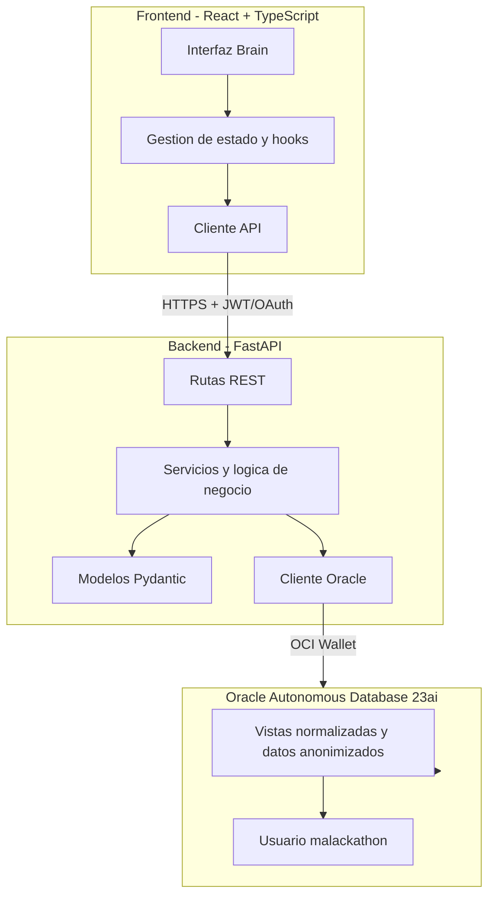

# Arquitectura de la aplicacion web Brain

```mermaid
graph TD
    subgraph Frontend [Frontend - React + TypeScript]
        UI[Interfaz Brain]
        State[Gestion de estado y hooks]
        APIClient[Cliente API]
    end

    subgraph Backend [Backend - FastAPI]
        Router[Rutas REST]
        Services[Servicios y logica de negocio]
        Schemas[Modelos Pydantic]
        DBClient[Cliente Oracle]
    end

    subgraph OracleADB [Oracle Autonomous Database 23ai]
        Views[Vistas normalizadas y datos anonimizados]
        User[Usuario malackathon]
    end

    UI --> State
    State --> APIClient
    APIClient -->|HTTPS + JWT/OAuth| Router
    Router --> Services
    Services --> Schemas
    Services --> DBClient
    DBClient -->|OCI Wallet| OracleADB
    OracleADB --> Views
    Views --> User
```
