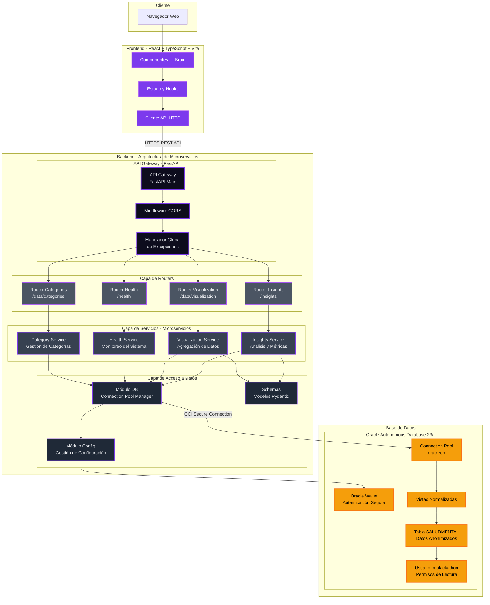

# Arquitectura de la aplicación web Brain

## Visión General

Brain implementa una **arquitectura basada en microservicios** para garantizar escalabilidad, mantenibilidad y separación de responsabilidades. El backend está organizado como un API Gateway que orquesta múltiples servicios independientes.

## Diagrama de Arquitectura

## Descripción de Componentes

### Frontend Layer
- **Componentes UI Brain**: Interfaz de usuario React con TypeScript
- **Estado y Hooks**: Gestión de estado de la aplicación con hooks de React
- **Cliente API HTTP**: Cliente HTTP para comunicación con el backend

### API Gateway Layer
- **API Gateway (FastAPI Main)**: Punto de entrada único que orquesta todos los microservicios
- **Middleware CORS**: Gestión de políticas de intercambio de recursos de origen cruzado
- **Manejador Global de Excepciones**: Captura y formatea errores de forma consistente

### Router Layer (Adaptadores de Entrada)
- **Router Insights** (`/insights`): Expone endpoints para resúmenes analíticos
- **Router Visualization** (`/data/visualization`): Expone endpoints para datos de visualización
- **Router Health** (`/health`, `/db/pool-status`): Expone endpoints de monitoreo
- **Router Categories** (`/data/categories`): Expone endpoints de gestión de categorías

### Service Layer (Lógica de Negocio - Microservicios)
- **Insights Service**: Microservicio para generación de insights y métricas agregadas
- **Visualization Service**: Microservicio para agregación de datos con filtros
- **Health Service**: Microservicio para verificación de salud y monitoreo de recursos
- **Category Service**: Microservicio para operaciones con categorías diagnósticas

### Data Access Layer
- **Módulo DB**: Gestión del pool de conexiones a Oracle con python-oracledb
- **Módulo Config**: Carga y validación de variables de entorno y configuración
- **Schemas**: Modelos Pydantic para validación y serialización de datos

### Database Layer
- **Oracle Autonomous Database 23ai**: Base de datos gestionada en OCI
- **Connection Pool**: Pool de conexiones oracledb para reutilización eficiente
- **Oracle Wallet**: Credenciales cifradas para autenticación segura
- **Vistas Normalizadas**: Estructuras de datos optimizadas
- **Tabla SALUDMENTAL**: Datos de admisiones de salud mental anonimizados
- **Usuario malackathon**: Usuario con permisos de solo lectura para evaluación

## Ventajas de la Arquitectura de Microservicios

1. **Separación de Responsabilidades**: Cada servicio tiene un propósito claro y único
2. **Escalabilidad**: Los servicios pueden escalarse independientemente según demanda
3. **Mantenibilidad**: Código más limpio, modular y fácil de mantener
4. **Testabilidad**: Cada microservicio puede ser testeado de forma aislada
5. **Resiliencia**: Fallos en un servicio no comprometen todo el sistema
6. **Desarrollo Paralelo**: Equipos pueden trabajar en servicios diferentes simultáneamente
7. **Despliegue Independiente**: Cada servicio puede desplegarse sin afectar a los demás

## Flujo de Datos

1. El usuario interactúa con la **UI de Brain** en el navegador
2. El **Cliente API** envía peticiones HTTP al **API Gateway**
3. El **Gateway** valida y enruta la petición al **Router** correspondiente
4. El **Router** delega la lógica de negocio al **Microservicio** apropiado
5. El **Microservicio** utiliza el **Módulo DB** para acceder a datos
6. El **Módulo DB** consulta **Oracle ADB 23ai** usando el pool de conexiones
7. Los datos se transforman usando **Schemas Pydantic** y se devuelven al frontend

## Tecnologías Clave

- **FastAPI**: Framework asíncrono para construir APIs con alto rendimiento
- **Pydantic**: Validación de datos y serialización
- **python-oracledb**: Driver nativo de Oracle para Python en modo thin
- **Oracle Autonomous Database 23ai**: Base de datos cloud gestionada
- **Docker**: Containerización para despliegue consistente
- **React + TypeScript + Vite**: Stack moderno de frontend

## Seguridad

- Autenticación mediante Oracle Wallet cifrado
- Validación de entrada con Pydantic
- CORS configurado para orígenes permitidos
- Sanitización de consultas SQL mediante parámetros
- Gestión segura de secretos mediante variables de entorno
- Usuario de base de datos con permisos de solo lectura
