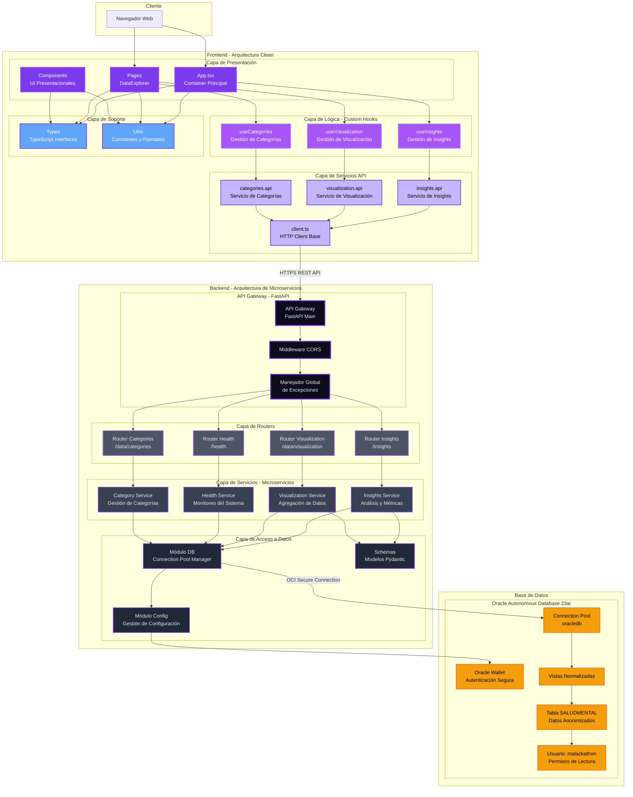

# Arquitectura de la aplicación web Brain

## Visión General

Brain implementa una **arquitectura basada en microservicios** para garantizar escalabilidad, mantenibilidad y separación de responsabilidades. El backend está organizado como un API Gateway que orquesta múltiples servicios independientes.

## Diagrama de Arquitectura



## Descripción de Componentes

### Frontend Layer - Arquitectura Clean

#### Capa de Presentación (UI)
- **App.tsx**: Container principal que orquesta toda la aplicación
- **Pages**: Páginas completas como DataExplorer con lógica de orquestación
- **Components**: Componentes presentacionales puros (BrainIcon, DataCharts, DataFilters, LayoutSection)

#### Capa de Lógica (Custom Hooks)
- **useInsights**: Hook para gestionar carga de insights, estados loading/error, y refetch
- **useVisualization**: Hook para gestionar datos de visualización con filtros reactivos
- **useCategories**: Hook para gestionar lista de categorías diagnósticas

#### Capa de Servicios API
- **insights.api**: Servicio para endpoints de insights (`/insights`)
- **visualization.api**: Servicio para endpoints de visualización (`/data/visualization`)
- **categories.api**: Servicio para endpoints de categorías (`/data/categories`)
- **client.ts**: Cliente HTTP base con manejo de errores y configuración centralizada

#### Capa de Soporte
- **Types**: Interfaces TypeScript compartidas (InsightSummary, DataVisualization, etc.)
- **Utils**: Utilidades (constants.ts con colores y navegación, formatting.ts con formateo de datos)

### API Gateway Layer
- **API Gateway (FastAPI Main)**: Punto de entrada único que orquesta todos los microservicios
- **Middleware CORS**: Gestión de políticas de intercambio de recursos de origen cruzado
- **Manejador Global de Excepciones**: Captura y formatea errores de forma consistente

### Router Layer (Adaptadores de Entrada)
- **Router Insights** (`/insights`): Expone endpoints para resúmenes analíticos
- **Router Visualization** (`/data/visualization`): Expone endpoints para datos de visualización
- **Router Health** (`/health`, `/db/pool-status`): Expone endpoints de monitoreo
- **Router Categories** (`/data/categories`): Expone endpoints de gestión de categorías

### Service Layer (Lógica de Negocio - Microservicios)
- **Insights Service**: Microservicio para generación de insights y métricas agregadas
- **Visualization Service**: Microservicio para agregación de datos con filtros
- **Health Service**: Microservicio para verificación de salud y monitoreo de recursos
- **Category Service**: Microservicio para operaciones con categorías diagnósticas

### Data Access Layer
- **Módulo DB**: Gestión del pool de conexiones a Oracle con python-oracledb
- **Módulo Config**: Carga y validación de variables de entorno y configuración
- **Schemas**: Modelos Pydantic para validación y serialización de datos

### Database Layer
- **Oracle Autonomous Database 23ai**: Base de datos gestionada en OCI
- **Connection Pool**: Pool de conexiones oracledb para reutilización eficiente
- **Oracle Wallet**: Credenciales cifradas para autenticación segura
- **Vistas Normalizadas**: Estructuras de datos optimizadas
- **Tabla SALUDMENTAL**: Datos de admisiones de salud mental anonimizados
- **Usuario malackathon**: Usuario con permisos de solo lectura para evaluación

## Ventajas de la Arquitectura Implementada

### Backend - Microservicios
1. **Separación de Responsabilidades**: Cada servicio tiene un propósito claro y único
2. **Escalabilidad**: Los servicios pueden escalarse independientemente según demanda
3. **Mantenibilidad**: Código más limpio, modular y fácil de mantener
4. **Testabilidad**: Cada microservicio puede ser testeado de forma aislada
5. **Resiliencia**: Fallos en un servicio no comprometen todo el sistema
6. **Desarrollo Paralelo**: Equipos pueden trabajar en servicios diferentes simultáneamente
7. **Despliegue Independiente**: Cada servicio puede desplegarse sin afectar a los demás

### Frontend - Clean Architecture
1. **Separación de Concerns**: UI, lógica de negocio y comunicaciones API claramente separadas
2. **Reutilización**: Custom hooks comparten lógica entre componentes sin duplicación
3. **Mantenibilidad**: Cambios en API solo afectan capa de servicios, no componentes
4. **Testabilidad**: Cada capa testeable independientemente (UI, hooks, API services)
5. **Type Safety**: TypeScript centralizado garantiza consistencia end-to-end
6. **Developer Experience**: Código limpio, imports organizados, constantes centralizadas
7. **Performance**: Hooks optimizados con useCallback, useMemo, y cleanup automático

## Flujo de Datos End-to-End

### Flujo Completo (Frontend → Backend → Database)

1. El usuario interactúa con **Componentes React** (App.tsx, DataExplorer)
2. Los componentes utilizan **Custom Hooks** (useInsights, useVisualization)
3. Los hooks llaman a **Servicios API** (insights.api, visualization.api)
4. Los servicios utilizan el **Cliente HTTP** centralizado
5. El cliente envía peticiones HTTPS al **API Gateway** (FastAPI)
6. El **Gateway** enruta al **Router** correspondiente
7. El **Router** delega al **Microservicio** apropiado
8. El **Microservicio** utiliza el **Módulo DB** para consultar Oracle
9. El **Módulo DB** usa el **Connection Pool** para acceder a Oracle ADB 23ai
10. Los datos se validan con **Schemas Pydantic** en el backend
11. Los datos se transforman con **Types TypeScript** en el frontend
12. Los **Components** renderizan la UI con los datos recibidos

### Flujo de Actualización de Filtros

1. Usuario cambia filtro en **DataFilters** component
2. **DataExplorer** actualiza estado de filtros
3. **useVisualization** hook detecta cambio automáticamente
4. Hook ejecuta nuevo fetch con filtros actualizados
5. Datos nuevos se propagan a **DataCharts** component
6. Gráficos se re-renderizan con datos filtrados

## Tecnologías Clave

- **FastAPI**: Framework asíncrono para construir APIs con alto rendimiento
- **Pydantic**: Validación de datos y serialización
- **python-oracledb**: Driver nativo de Oracle para Python en modo thin
- **Oracle Autonomous Database 23ai**: Base de datos cloud gestionada
- **Docker**: Containerización para despliegue consistente
- **React + TypeScript + Vite**: Stack moderno de frontend

## Estructura de Archivos

### Frontend (`app/front/src/`)

```
src/
├── api/                      # Capa de Servicios API
│   ├── client.ts            # Cliente HTTP base con manejo de errores
│   ├── insights.api.ts      # Servicio de insights
│   ├── visualization.api.ts # Servicio de visualización
│   ├── categories.api.ts    # Servicio de categorías
│   └── index.ts             # Barrel export
│
├── hooks/                    # Custom Hooks (Lógica de Negocio)
│   ├── useInsights.ts       # Hook para insights
│   ├── useVisualization.ts  # Hook para visualización con filtros
│   ├── useCategories.ts     # Hook para categorías
│   └── index.ts             # Barrel export
│
├── components/               # Componentes Presentacionales
│   ├── BrainIcon.tsx        # Icono del logo Brain
│   ├── DataCharts.tsx       # Gráficos con Recharts
│   ├── DataFilters.tsx      # Controles de filtrado
│   └── LayoutSection.tsx    # Layout wrapper
│
├── pages/                    # Páginas/Containers
│   └── DataExplorer.tsx     # Página de exploración de datos
│
├── types/                    # TypeScript Types
│   ├── insights.ts          # Tipos para insights
│   ├── data.ts              # Tipos para visualización
│   └── api.ts               # Tipos para API responses
│
├── utils/                    # Utilidades
│   ├── constants.ts         # Constantes (colores, navegación)
│   ├── formatting.ts        # Funciones de formateo
│   └── index.ts             # Barrel export
│
├── App.tsx                   # Componente principal
├── main.tsx                  # Entry point
└── index.css                 # Estilos globales
```

### Backend (`app/back/`)

```
back/
├── services/                 # Microservicios (Lógica de Negocio)
│   ├── insights_service.py  # Servicio de insights
│   ├── visualization_service.py # Servicio de visualización
│   ├── health_service.py    # Servicio de health check
│   └── category_service.py  # Servicio de categorías
│
├── routers/                  # HTTP Routers (Adaptadores)
│   ├── insights.py          # Router de insights
│   ├── visualization.py     # Router de visualización
│   ├── health.py            # Router de health
│   └── categories.py        # Router de categorías
│
├── main.py                   # API Gateway
├── config.py                 # Configuración
├── db.py                     # Connection pool manager
├── schemas.py                # Modelos Pydantic
└── Dockerfile                # Containerización
```

## Seguridad

- Autenticación mediante Oracle Wallet cifrado
- Validación de entrada con Pydantic
- CORS configurado para orígenes permitidos
- Sanitización de consultas SQL mediante parámetros
- Gestión segura de secretos mediante variables de entorno
- Usuario de base de datos con permisos de solo lectura
- Type safety con TypeScript en frontend previene errores en runtime
- AbortController para cancelar peticiones y prevenir memory leaks
